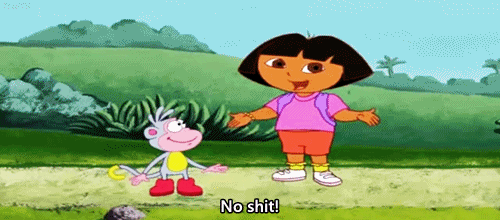
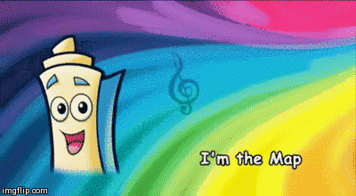
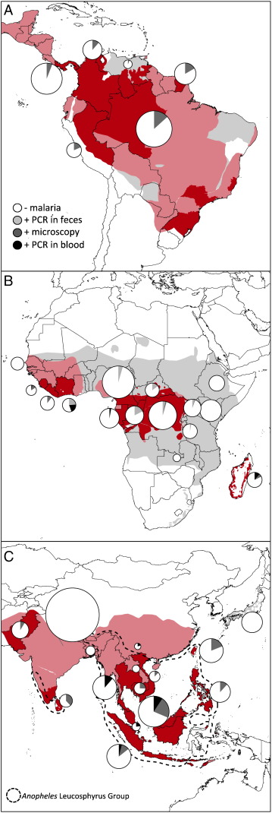
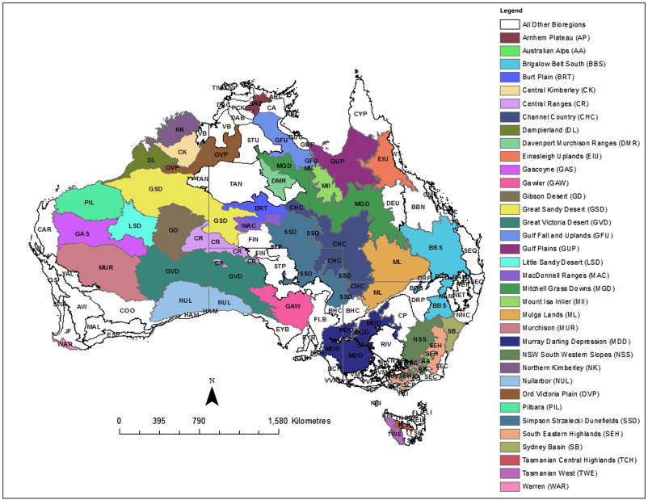
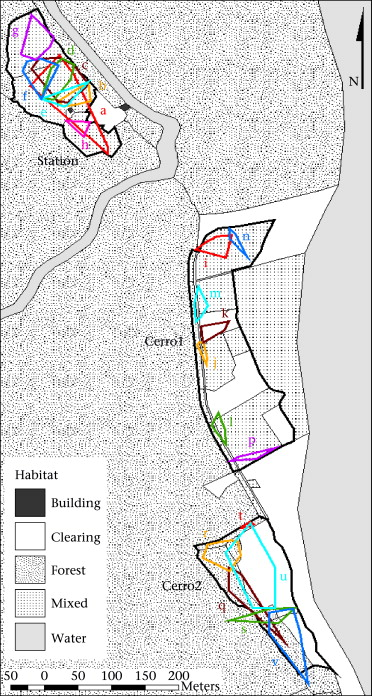

```{r}
knitr::opts_chunk$set(
    echo = TRUE,
    warning = FALSE,
    comment = "##",
    prompt = FALSE,
    tidy = TRUE,
    tidy.opts = list(width.cutoff = 75),
    fig.path = "img/"
)
```

#Geospatial Data Analysis
##December 8, 2016
###Rachel, Allison & Silvy 

##Objectives: 
>In this lesson, you will learn about geospatial information and the analyses that can be done with it. We will download, manipulate, and transform data sets. Data can be projected in different ways for different purposes. We will use both home range data and geographic range data for our examples, and overlay these layers with other relevant data layers, such as altitude and land forms. This data can be visually and statistically analyzed. Finally, we will create a publication ready map!

##Introduction
Geospatial information is critical for analyzing data on landscapes, range, demographics, etc. Visualizing geospatial data on a map is helpful for thinking about the implications of your results. Spatial data analyses address questions that cannot be answered by simply looking at the data themselves, and are concerned with the quantitative location of important features.

##Why use R??



You can project anything that you want on a map using geospatial methods in R. Developers have been creating and updating R spatial data packages for the alst 10 years. R is equipped to handle the large data sets that are often required for spatial analysis. Geographic Information Systems (GIS) is a computer based system to aid in the collection, maintenance, storage, analysis, output, and distribution of spatial data and information. However, ArcGIS is a very expensive software ($1,500 for a single license), but all of its skills and tricks can be done in R for free!

##Applications:
* Create maps
* Visualize spatial data
* Project metadata
* Predict variables
* Layers and layers of spatial data visualization

##Useful skills you'll learn today:
* __Install__ basemaps from multiple sources
* __Subsetting__ internet based data
* __Create__ and/or download shapefiles
* __Manipulate__ shapefiles and polygons
* Range __analyses__
* __Access__, __analyze__, and __transform__ metadata
* MAPS, MAPS, MAPS!



##Key Concepts
__Geographic coordinate system__ is a common spherical coordinate reference system for specifying location of features on the curved surface of the earth used to define the spatial location and extent of geographic objects. Coordinates define location in two or three-dimensional space. Coordinate pairs, x and y, or coordinate triples, x, y, and z, are used to define the shape and location of each spatial object or phenomenon. The longitude is the east or west location of a point, and the latitude is the north or south location of a point.    

__The Universal Transverse Mercator projection__ is a cylindrical projection of the world's layout on a map that touches at the equator. A projection is a mathematical transformation of the globe onto some other surface, in this case, a grid. UTM is the typical projection used in GIS and spatial analyses.    

__Attributes__ are feature characteristics that can be plotted on a map.   

__Vector data__ models use discrete elements such as points, lines, and polygons to represent the geometry of real-world entities.

__Raster data__ models are the natural means to represent continuous spatial features or phenomenon. They define the world as a regular set of cells in a grid pattern that are square and evenly spaced in the x and y directions.    

__Point__: single point location, such as a GPS reading or a geocoded address  

__Line__: set of ordered points, connected by straight line segments    

__Polygon__: area, marked by one or more enclosing lines, possibly containing holes 

__Grid__: collection of points or rectangular cells, organised in a regular lattice (raster data)    


##Current research and applications
__Faust C, Dobson AP. 2015. Primate malarias: diversity, distribution and insights for zoonotic Plasmodium. One Health 1:66-75.__  
* Meta-analysis quantifying the global distribution, host range, and diversity of non-human primate malarias globally  
* Using R, survey data was merged with IUCN spatial data for primate species geographic range  
* This map shows prevalence of primate malarias by region. Non-white portions of pie charts show proportion infected and reflect sampling method  



__Williams AN, Ulm S, Cook AR, Langley MC, Collard M. 2013. Human refugia in Australia during the Last Glacial Maximum and Terminal Pleistocene: a geospatial analysis of the 25-12 ka Australian archaeological record. Journal of Archaeological Science 40:4612-4625.__  
* Evaluated models of Aboriginal Australian popoulation response to climate change using comprehensive continent-wide dataset of archaeological radiocarbon ages and geospatial techniques.  
* Used ArcGIS, R, and Geospatial Modelling Environment (GME)  



__Vonhof MJ, Whitehead H, Fenton MB. 2003. Analysis of Spix's disc-winged bat association patterns and roosting home ranges reveal a novel social structure among bats. Animal Behavior 68:507-521.__  
* Using GIS methods from field work GPS points, authors found that various social groups of the same species overalp in space, but rarely interact socially, perhaps based on kinship and cooperation.  
* Map shows different habitat types (in gray) and roosting home range polygons of 21 social groups of _Thyroptera tricolor_  



 
##Additional resourcese and useful links
["Use R!: Applied Spatial Data Analysis with R"] (http://gis.humboldt.edu/OLM/r/Spatial%20Analysis%20With%20R.pdf)  
["R useful cheatsheet"] (www.maths.lancs.ac.uk/~rowlings/Teaching/UseR2012/cheatsheet.html)   
["Introduction to Visualizing Spatial Data in R"] (https://cran.r-project.org/doc/contrib/intro-spatial-rl.pdf)

##Heat map of Titi Monkey distribution
```{r}
#Heat map of all the Titis in Tiputini
hothothot <- ggplot(points, aes(x=UTMX, y=UTMY)) + geom_point() + stat_density2d(aes(fill=..density..), geom = "tile", contour = FALSE) + scale_fill_gradient2(low = "white", high = "red")
hothothot
```

##Chi square test of complete spatial randomness (CSR) of points
```{r}
csrMap <- rpoispp(lambda = 10, all)
qTest <- quadrat.test(csrMap, nx = 3, ny = 3)
qTest
plot(qTest) #we need to understand this plot and be able to explain wtf it means
#high p-value here shows that our point distribution is not random, which makes sense because the three groups of titis stick to their home ranges
```

#Silvy's part
```{r}
library(maptools)
library(sp)
library(rgdal)
library(curl)
library(spatstat)
library(ggplot2)

#Let's first load in a polygon of the trail sytem at the Tiputini Biological Station in Ecuador. This can be done with the readShapeLines() function in the *maptools* package. 
tbs <- readShapeLines("C:\\Users\\Allison\\Desktop\\ADA2016\\GISDATA\\trail_polylines.shp")
plot(tbs)

tbs@proj4string # This command shows us that there is no Coordinate System assigned to the TBS shapefile. 
proj4string(tbs) <- NA_character_ # remove Coordinate Reference System information from TBS shapefile.
proj4string(tbs) <- CRS("+proj=utm +zone=18 +south +units=m +datum=WGS84") #Setting UTM WGS84 as our Coortinate Reference System (CRS).

f <- curl("https://raw.githubusercontent.com/Callicebus/vignette/master/GPScoordinates.csv")
points <- read.csv(f)
head(points)
s <- SpatialPointsDataFrame(coords=c(points[5],points[6]),data=points[4])
str(s)
plot(s, pch = 1, col = s$Group)

utm <- SpatialPoints(s, proj4string=CRS("+proj=utm +zone=18 +south +datum=WGS84"))
utm <- SpatialPointsDataFrame(utm, data=points[4])
plot(utm, pch = 20, col = utm$Group)
all <- plot(tbs, add=TRUE)
```

#Section 1: Subsetting and Mapping Internet-Based Spatial Data
Packages to Install:
```{r}
install.packages(rgdal)
install.packages(maptools)
install.packages(ggmap)
```
There are several sources of species spatial data that can be found for free on the internet. The IUCN Red List of Threatened Species is only one example, and offers comprehensive spatial datasets for mammals and many other animal groups. IUCN is great source because it includes information on the protected status of the species in addition to geographical ranges. The datasets can be found [here](http://www.iucnredlist.org/technical-documents/spatial-data), and additional information on the included attributes can be found [here](http://spatial-data.s3.amazonaws.com/groups/METADATA%20for%20Digital%20Distribution%20Maps%20of%20The%20IUCN%20Red%20List%20of%20Threatened%20Species%E2%84%A2.pdf).

The IUCN Red List also offers the opportunity to download spatial data for individual species, but in order to do so you must make an account and fill out a data request form. To avoid this extra step, you can instead use one of the comprehensive spatial datasets mentioned above and create a subset of your species of interest.

For this particular example, we want to look at home ranges for Callicebus species, so we'll be using the IUCN dataset for terrestrial mammals.

##Part 1: Subsetting Spatial Data
###Read in the IUCN spatial data for terrestrial mammals
```{r}
library(rgdal)
tm <- readOGR(dsn = path.expand("~/Desktop/ADA/IUCN_Mammals"), layer = "TERRESTRIAL_MAMMALS")
ogrInfo(dsn = path.expand("~/Desktop/ADA/IUCN_Mammals"), layer = "TERRESTRIAL_MAMMALS")
```
The package 'rgdal' is one of many that you can use to load in spatial data. For others, check out Module 21 on the [Applied Data Analysis GitHub repository](https://github.com/difiore/applied-data-analysis).

NOTE: When you download the terrestrial mammals file, the folder will automatically be named "TERRESTRIAL_MAMMALS" - the same name as the shapefiles. If you try to read in the spatial data where the dsn and layer names are the same, it will not work. Here, we've changed the folder name (the dsn) to IUCN_Mammals - problem solved!


###Separate out spatial data for your species of interest
```{r}
#Create subset
names(tm)
subset <- tm[tm$genus_name=="Callicebus",]
```
Before we can make our Callicebus subset, we need to look at what attributes are included in our data. Attribute variables can be found with the command names(tm). In doing so, we see that there's an attribute labeled genus_name - perfect! We can now subset our data for the Callicebus genus. 

All shapefiles have both an attribute table and geometry data, which are both loaded automatically with the readOGR() command. The attribute table can be treated the same as a data frame, which is useful when we're trying to get a subset of our data. The second line of code asks R to select rows from our 'tm' dataset where genus_name is equal to Callicebus. Since we want all of the columns associated with rows where genus_name is equal to Callicebus, we leave the area to the right of the comma blank. Here, we do not call specifically to the data slot because we want to include spatial _and_ attribute data included in our subset dataset.


###Create shape files for subset
If we want to be able to work with this subset in future work, it might be nice to create a set of files separate from 'tm'. This way, we can avoid the ten minute wait-time needed to load the entire terrestrial mammals dataset every time we want to look at spatial data for Callicebus species specifically. 
```{r}
writeOGR(obj = subset, dsn = path.expand("~/Desktop/ADA/IUCN_Mammals"), layer = "callicebus", driver = "ESRI Shapefile")

#Read in subset spatial data
cbs <- readOGR(dsn = path.expand("~/Desktop/ADA/IUCN_Mammals"), layer = "callicebus")
plot(cbs)
```
Still using package 'rgdal', we create the shapefile with the function writeOGR. The function calls for an spatial data object, a data source name, a layer name, and a driver. Here, our object is our subset, which we want to store in the IUCN_Mammals folder (our data source) with the name "callicebus" (our layer name). A driver is a software component plugged in on demand

Now that we've created shapefiles specifically for Callicebus species, we can load it in the same way we loaded our original terrestrial mammals dataset. To double check that we did this correctly, we use the plot() command - success!

##Part 2: Mapping Spatial Data with *ggplot2*
###Plotting spatial data with ggmap and ggplot2
*ggmap* is based on the *ggplot2* package and can be used to replace the base graphics in R. While *qplot()* and *ggplot()* from *ggplot2* require more data preparation than the base *plot()* function, *ggplot2* automatically selects colors and legends with more visually appealing defaults.

To start, then, we need to transform our data so that *ggplot2* can read it. *ggplot2* cannot use spatial objects directly like *plot()*, but instead requires spatial data to be supplied as a data frame. We can do this using the *fortify()* command from *ggplot2* package.
```{r}
library(ggplot2)
cbs_f <- fortify(cbs)
head(cbs_f, n=2)
```
Looking at our fortified data, we can see that we have lost the attribute information associated with the cbs object. To add it back, we use the *left_join()* function from the *dplyr* package. 
```{r}
library(dplyr)
cbs$id <- row.names(cbs) #allocate an id variable to the cbs data
cbs_f <- left_join(cbs_f, cbs@data) #join the data
head(cbs_f)
```
Taking a peek at our fortified cbs data shows that our attribute data has been successfully added back in.

Now that our spatial data is in a form that *ggplot2* can work with, we can produce a map! 
```{r}
map <- ggplot(cbs_f, aes(long, lat, group=group, fill=friendly_n)) + geom_polygon() +
  coord_equal() +
  labs(x="Longitude", y="Latitude") +
  ggtitle("Callicebus Distributions")
map
```
So what did we do here? Within the ggplot() command, we tell ggplot what data we wish to use and then set the aesthetics. The group=group points ggplot to the group column added by fortify and identifies the groups of coordinates that pertain to individual polygons. Since we want to look at distributions of different species, we set the fill to "friendly_n" (the IUCN version of species name). *coord_equal* ensures that the ranges of axes are equal to the specified ratio, where the default is equal to 1. Then we can put on some labels, a title, and we're good to go!

###Adding base maps to *ggplot2* with *ggmap*
While it's handy to have a general sense of how species distributions are laid out, we ultimately want to know where they're situated on a base map. This is where *ggmap* comes in - with *ggmap*, we can create a base map that will ultimately be overlaid with our species distribution data.

Before we create the base map, we first need to create the bounding box of our cbs data so that we can identify the extent of the image tiles that we need.
```{r}
bb <- bbox(cbs)
b <- (bb-rowMeans(bb)) * 1.05 + rowMeans(bb)
```
The first line of code identifies the bounding box based on our cbs spatial data. The second line of code zooms in on your bounding box by about 5% - to zoom in farther, replace 1.05 with 1.xx for an xx% increase in the plot size.

With our bounding box in hand, we can load in a base map with *ggmap*!

*ggmap* can create base maps from Google Maps, OpenStreetMap, Stamen maps, or CloudMade maps using the command *get_map()*. Today we'll be using maps from Stamen; the watercolor map for its ridiculous beauty and the toner map to so we can see country borders.
```{r}
library(ggmap)

#Watercolor map
sa_wcmap <- get_map(location = b, source="stamen", maptype = "watercolor")
sa_wcmap <- ggmap(sa_wcmap)
sa_wcmap

#Toner map
sa_tmap <- get_map(location = b, source="stamen", maptype = "toner")
sa_tmap <- ggmap(sa_tmap)
sa_tmap
```

Success! Base maps have been successfully acquired. We can now take our cbs spatial data from earlier and map it onto our Stamen-toner base map. 
```{r}
library(mapproj)
map <- sa_tmap + geom_polygon(data=cbs_f, aes(long, lat, group=group, fill=friendly_n, alpha = 0.5)) + #data EQUALS.
  coord_equal() +
  labs(x="Longitude", y="Latitude") +
  ggtitle("Callicebus Distributions") 
map
```
Here, we take our base map and add our fortified data with *geom_polygon()*. Be sure to add in "data=" before calling your data - otherwise ggplot2 will throw an error message at you. Everything else in this step is the same as when we originally mapped the cbs data apart from alpha. The alpha value defines the transparency of the polygon's fill, where the default = 1 (opaque).

###Adding Geographical Data
Now that we know where our species distributions are located in South America, it may also be helpful to add in geographical data such as rivers, lakes, and elevation. These may be helpful in determining what influences species distributions. 

River and lake data can be found for free on [Natural Earth](http://www.naturalearthdata.com/) under the downloads section. They provide many other kinds of data that you can download as well, so it's good resource to keep in mind for future mapping projects.

For rivers and lakes, Natural earth provides a few different file options depending on the scale of your data. They range from detailed maps for large-scale data to basic maps for small-scale data. Today we'll be using the most detailed dataset. 

Natural Earth also allows you to choose between the basic file and the file with scale ranks + tapering. For our purposes, it doesn't make a difference which you choose - since we're zoomed out fairly far, they look exactly the same when they're mapped. 

Just like we've done earlier, before we map our river and lake data, we need to load it in and *fortify()* it so that it can be read by *ggplot2*.   
```{r}
water <- readOGR(dsn = path.expand("~/Desktop/ADA/IUCN_Mammals/rivers+lakes_10"), layer = "ne_10m_rivers_lake_centerlines")
water_f <- fortify(water)
water$id <- row.names(water) 
water_f <- left_join(water_f, water@data) 
```

Now we can map it with ggmap. First, let's see how the rivers and lakes look without our species distribution. We'll use the watercolor base map for a cleaner map.  
```{r}
watermap <- sa_wcmap + geom_path(data=water_f, aes(x=long, y=lat, group=group))
watermap
```
Et voila! Our waterways have been mapped! Because we're working with spatial lines data (not polygons, as with our species distributions), we need to use the geom_path() command. You may be tempted to use geom_line(), but don't! geom_line() uses the order of the x-axis to connect the points, and will end up putting in lines where they don't belong. geom_path() uses the actual order of the values in the data frame. 

Side note - now that we've done all of this work, you should know that this base map and others that you can get with *ggmap* actually already have waterways. However, you can't see them unless you're zoomed in quite a bit farther.  


```{r}
water_cbs <- map_wcmap + geom_polygon(data=cbs_f, aes(long, lat, group=group, fill=friendly_n, alpha = 0.5)) +
  geom_path(data=water_f, aes(x=long, y=lat, group=group)) +
  coord_equal() +
  labs(x="Longitude", y="Latitude") +
  ggtitle("Callicebus Distributions") 
water_cbs
```


Add IUCN Codes 
```{r}
library(maps)
cnames <-aggregate(cbind(long, lat) ~ friendly_n, data = cbs, FUN = function(x) mean(range(x)))

sa_gmap <- get_map(location = b, source="stamen", maptype = "watercolor")
map_gmap <- ggmap(sa_gmap)

cbs_code <- map_gmap + geom_polygon(data=cbs_f, aes(long, lat, group=group, fill=code, alpha = 0.5)) + #data EQUALS.
  coord_equal() +
  labs(x="Longitude", y="Latitude") +
  ggtitle("Callicebus Distributions") 
cbs_code

sa_tmap <- get_map(location = b, source="stamen", maptype = "toner")
map_tmap <- ggmap(sa_tmap)

cbs_code <- map_tmap + geom_polygon(data=cbs_f, aes(long, lat, group=group, fill=code, alpha = 0.5)) + #data EQUALS.
  coord_equal() +
  labs(x="Longitude", y="Latitude") +
  ggtitle("Callicebus Distributions") 
cbs_code
```
