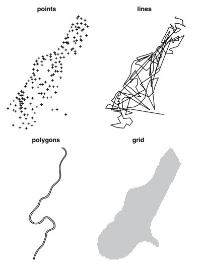

```{r}
knitr::opts_chunk$set(
    echo = TRUE,
    warning = FALSE,
    comment = "##",
    prompt = FALSE,
    tidy = TRUE,
    tidy.opts = list(width.cutoff = 75),
    fig.path = "img/"
)
```

#Geospatial Data Analysis
##December 8, 2016
###Rachel, Allison & Silvy

Geospatial information is critical for analyzing data on landscapes, range, demographics, etc. Visualizing geospatial data on a map is helpful for thinking about the implications of your results. Spatial data analyses address questions that cannot be answered by simply looking at the data themselves, and are concerned with the quantitative location of important features. Geospatial data has a geographic component to it. It is used to plot locations, regions, ranges, etc. 

##Why use R??
You can project anything that you want on a map using geospatial methods in R. Developers have been creating and updating R spatial data packages for the alst 10 years. R is equipped to handle the large data sets that are often required for spatial analysis. Geographic Information Systems (GIS) is a computer based system to aid in the collection, maintenance, storage, analysis, output, and distribution of spatial data and information. However, ArcGIS is a very expensive software ($1,500 for a single license), but all of its skills and tricks can be done in R for free!

##Objectives: 
* Explain geospatial data uses and applications
* Find, download, and manipulate data
* Display population home range data
* Display taxa geographic range data
* Overlay data layers from multiple sources
* Visually and statistically analyze metadata
* Create a publication ready map

##Applications:
* Create maps
* Visualize spatial data
* Project metadata
* Predict variables
* Layers and layers of spatial data visualization

##Useful skills:
* __Install__ basemaps from multiple sources
* __Create__ and/or download shapefiles
* __Manipulate__ shapefiles and polygons
* __Access__, __analyze__, and __transform__ metadata
* MAPS, MAPS MAPS!

##Key Concepts
__Geographic coordinate system__ is a common spherical coordinate reference system for specifying location of features on the curved surface of the earth used to define the spatial location and extent of geographic objects. Coordinates define location in two or three-dimensional space. Coordinate pairs, x and y, or coordinate triples, x, y, and z, are used to define the shape and location of each spatial object or phenomenon. Coordinates represent the longitude and latitude of a specific point on a map. The longitude is the east or west location of a point, and the latitude is the north or south location of a point.  
__The Universal Transverse Mercator projection__ is a cylindrical projection of the world's layout on a map that touches at the equator. A projection is a mathematical transformation of the globe onto some other surface, in this case, a grid. UTM is the typical projection used in GIS and spatial analyses.  
__Attributes__ are feature characteristics that can be plotted on a map.  
__Vector data__ models use discrete elements such as points, lines, and polygons to represent the geometry of real-world entities.  
__Raster data__ models are the natural means to represent continuous spatial features or phenomenon. They define the world as a regular set of cells in a grid pattern that are square and evenly spaced in the x and y directions.  
__Coordinate systems__ must be defined from the start of a project.   
A map __projection__ is a systematic rendering of locations from the curved from the curved Earth surface onto a flat map surface. Points are projected from the Earth surface and onto the map surface.  
__Point__: single point location, such as a GPS reading or a geocoded address  
__Line__: set of ordered points, connected by straight line segments  
__Polygon__: area, marked by one or more enclosing lines, possibly containing holes  
__Grid__: collection of points or rectangular cells, organised in a regular lattice (raster data)  

image: 


##Examples of the cool maps that can be created


##Current research and applications
Faust C, Dobson AP. 2015. Primate malarias: diversity, distribution and insights for zoonotic Plasmodium. One Health 1:66-75.

##Additional resourcese and useful links
["Use R!: Applied Spatial Data Analysis with R"] (http://gis.humboldt.edu/OLM/r/Spatial%20Analysis%20With%20R.pdf)  
["R useful cheatsheet"] (www.maths.lancs.ac.uk/~rowlings/Teaching/UseR2012/cheatsheet.html) 
["Introduction to Visualizing Spatial Data in R"] (https://cran.r-project.org/doc/contrib/intro-spatial-rl.pdf)

```{r}
install.packages("EBImage")
library(EBImage) #comp cant find package
g <- system.file("img", "dora.gif", package = "EBImage")
gif <- readImage(g)
display(gif)
````

image: 
"
